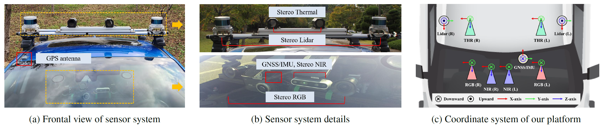
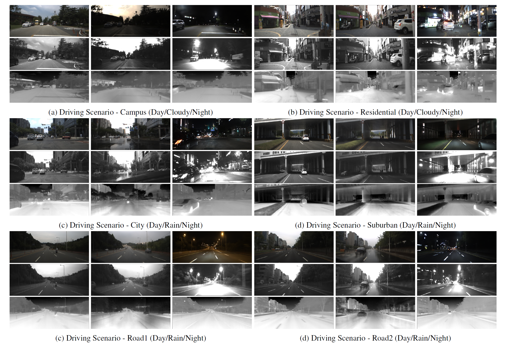

# Multi-Spectral Stereo ($MS^2$) Outdoor Driving Dataset

This is the official Github page of the $MS^2$ dataset described in the paper:

 >Deep Depth Estimation from Thermal Image
 >
 >[Ukcheol Shin](https://ukcheolshin.github.io/), Jinsun Park, In So Kweon
 >
 >IEEE/CVF Conference on Computer Vision and Pattern Recognition (CVPR), 2023
 >
 >[[Paper]()] [[Project page]()]

### Updates
- 2023.03.30: Open Github page.
- TBA: The datset will be be released in April. 

## $MS^2$ Dataset Specification
### Sensor System
We designed a data collection platform that consists of RGB, NIR, thermal, and LiDAR stereo system along with a GPS/IMU module.

### Dataset Example
The collected dataset are taken under locations of campus, city, residential area, road, and suburban with various time slots (morning, day, and night) and weather conditions (clear-sky, cloudy, and rainy). According to the surrounding conditions, each spectrum sensor shows different
aspects, advantages, and disadvantages induced by their sensor characteristics.

